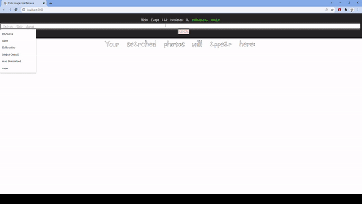

# Flickr Image Link Retriever

Flickr Image Link Retriever is a ReactJS web app built with Axios and Flickr's REST api to enable searching and retrieval of Flickr images. The user can currently enter one search criteria and receive the first 10 images.

This project is hosted on Heroku -> https://flickr-image-link-retriever.herokuapp.com/  

